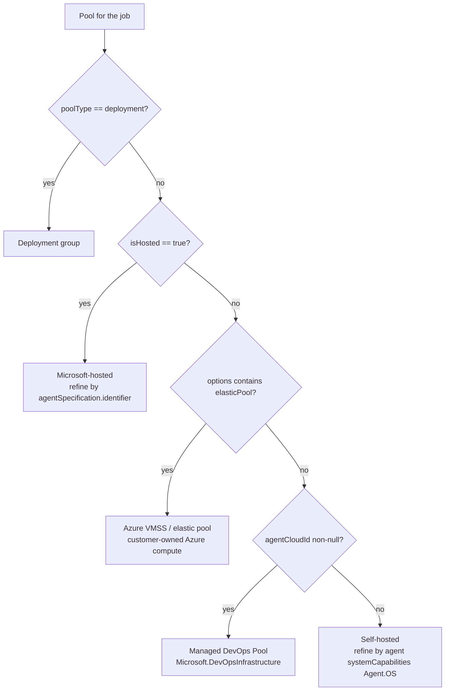
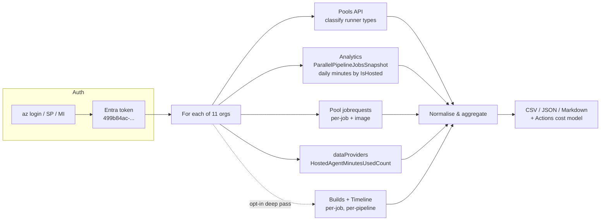

# Extracting Total Azure DevOps Build Minutes by Runner Type Across Multiple Organizations

**Research question (large enterprise customer):**
> "We are currently gathering the total build minutes used across all our Azure DevOps instances. Do you have any tools or mechanisms to extract the total stats broken down by runner type? These stats will be critical for one of our high priority activities."

**In-scope organizations (11, from the supplied customer inventory):**
`contoso-eng`, `contoso-platform`, `contoso-retail`, `contoso-stores`, `contoso-cloud`, `contoso-data`, `contoso-mobile`, `contoso-security`, `contoso-ops`, `contoso-shared`, `your-org-name` — representing a large enterprise customer with 11 Azure DevOps organizations in one Entra tenant context.

**Query type:** Process/how-to + technical deep-dive hybrid.

---

## Executive Summary

1. **There is no first-party Microsoft tool or report that produces "total build minutes by runner type across multiple organizations."** Azure DevOps does not bill by the minute — it bills by *concurrent parallel jobs* purchased per organization — so minutes are not a first-class billing dimension and are not surfaced as a cross-org report.[^1][^2] The number must be assembled from the REST and Analytics OData APIs.
2. **The data absolutely is available.** Every executed pipeline job's start/finish timestamps and its agent pool are retrievable, and `TaskAgentPool.isHosted` gives an authoritative Microsoft-hosted vs self-hosted classification.[^3][^4] The engineering work is orchestration (11 orgs × N projects × M builds), throttling, and correct de-duplication — not data availability.
3. **Four complementary data sources exist**, each with different cost/fidelity/retention trade-offs: the Build Timeline API (authoritative, expensive), the pool `jobrequests` API (cheap, per-job, short window, includes the hosted **image**), Analytics OData `ParallelPipelineJobsSnapshot` (pre-aggregated daily minutes by `IsHosted` — the cheapest direct answer), and an undocumented data-provider endpoint that returns the org's actual `HostedAgentMinutesUsedCount` for the current billing period.[^5][^6][^7][^8]
4. **A critical correctness trap was identified:** the Analytics entity `TaskAgentRequestSnapshots` (which backs the built-in Pool Consumption Report) is a **10-minute time-series snapshot with one row per (RequestId × sampling interval)** — naively summing its durations inflates results by roughly the job duration ÷ 10 minutes. Microsoft's own dashboards aggregate it as *concurrent-job-count × 10 minutes*.[^9][^10]
5. **Authentication should use Microsoft Entra ID, not PATs.** A single `az login` / service-principal token for resource `499b84ac-1321-427f-aa17-267ca6975798` works across all 11 organizations when they share one Entra tenant, and works for both `dev.azure.com` REST and `analytics.dev.azure.com` OData.[^11][^12]

**Recommendation:** build a small, purpose-built extractor (delivered as part of this engagement) that runs a cheap Analytics/aggregate pass for headline numbers and an optional deep Timeline pass for per-pipeline attribution, cross-checked against the billing-period counter.

---

## 1. Why "Build Minutes" Is the Wrong Native Unit (and what to tell the customer)

Azure DevOps sells **parallel jobs** — concurrency lanes — not minutes.[^1]

| Tier | Microsoft-hosted | Self-hosted |
|---|---|---|
| Free (private projects) | 1 parallel job, **1,800 min/month**, 60 min max per job | 1 parallel job + 1 per active Visual Studio Enterprise subscriber |
| Paid | ~USD **$40**/month per parallel job, 360 min job limit, **no monthly minute cap** | ~USD **$15**/month per parallel job, no time limit |

Confirm current prices at the Azure DevOps pricing page before quoting.[^13] The Azure Cost Management meter names are **"MS-Hosted CI/CD"** and **"Self-Hosted CI/CD"**, pro-rated at 1/31st of a unit per day.[^2]

**Consequence:** once an org is on paid parallel jobs, minutes are *unmetered* by Microsoft. The 1,800-minute counter in the UI only governs the free tier. So the customer's ask ("total build minutes by runner type") is almost certainly **not a billing reconciliation** — it is a **sizing/business-case exercise**, most plausibly for a GitHub Actions migration, where per-minute billing *does* apply and runner type carries a cost multiplier.

That reframing matters: it tells us the output must be **minutes bucketed by runner type and OS/image**, because that is exactly the input a GitHub Actions cost model needs.

### Where an admin can see anything natively today

| Surface | URL | Shows | Limitation |
|---|---|---|---|
| Parallel jobs / billing | `.../_settings/buildqueue?_a=concurrentJobs` | Purchased parallel jobs; free-tier minutes used this month | Current month only, no history, no export, no documented API |
| **Pool consumption report** | Org settings → Agent pools → *pool* → Analytics | Running vs queued jobs vs concurrency, 10-min granularity, **up to 30 days** | Per pool, per org; concurrency chart not cumulative minutes; **Project Collection Administrator required** |
| Usage | `.../_settings/usage` | TSTU/rate-limit consumption per user | **Not build minutes** — a common misreading |
| Pipeline duration report | Pipeline → Analytics | p50/p80/p95 duration for one pipeline | Single pipeline, 14-day default, no pool breakdown |

None of these roll up across organizations.[^5][^14][^15]

---

## 2. Authentication — Entra ID, Not PATs

The customer requirement is to avoid PATs. This is fully supported.

**Azure DevOps Entra resource ID:** `499b84ac-1321-427f-aa17-267ca6975798` (scope `499b84ac-1321-427f-aa17-267ca6975798/.default`; equivalent to `https://app.vssps.visualstudio.com/.default`).[^11]

```bash
az login
TOKEN=$(az account get-access-token \
  --resource 499b84ac-1321-427f-aa17-267ca6975798 \
  --query accessToken -o tsv)

curl -H "Authorization: Bearer $TOKEN" \
  "https://dev.azure.com/contoso-eng/_apis/projects?api-version=7.1"

# Same token works for Analytics OData
curl -H "Authorization: Bearer $TOKEN" \
  "https://analytics.dev.azure.com/contoso-eng/_odata/v4.0-preview/\$metadata"
```

Key facts:

- **One token covers all 11 orgs** provided they are backed by the same Entra tenant. An org connected to a different tenant needs `az login --tenant <other>` and a separate token.[^11]
- Tokens last ~1 hour; refresh in-process for long extractions.
- **Service principals and managed identities are GA** as Azure DevOps org members: create the app registration, take the **Enterprise Application object ID** (not the app registration object ID), add it via Organization Settings → Users with **Basic** access, and grant it read permissions.[^12] They can be added programmatically via the `serviceprincipalentitlements` API.
- SP limitations that matter here: SPs **cannot create PATs**, cannot sign in interactively, and — critically — **have no user profile**, so the `profile/profiles/me` → `accounts?memberId=` org-discovery chain does not work for them.[^12][^16] **Design decision: supply the org list from config.**
- Python: `azure-identity` → `credential.get_token("499b84ac-1321-427f-aa17-267ca6975798/.default")` → plain `Bearer` header. `DefaultAzureCredential` covers az-CLI, env-var SP, managed identity, and workload-identity federation in one object.
- **Permissions:** `View analytics` (default for Basic Contributors) covers standard Analytics entities; **Project Collection Administrator is explicitly required** for the pool consumption data (`TaskAgentRequestSnapshots`).[^9] Agent pool *read* generally needs pool Reader at org level, not full PCA.

A PAT fallback (`vso.build`, `vso.agentpools`, `vso.analytics`) should exist in the tool but be off by default.

---

## 3. Classifying "Runner Type" — the Authoritative Method

Runner type comes from the **agent pool**, retrieved once per org:

```
GET https://dev.azure.com/{org}/_apis/distributedtask/pools?api-version=7.1
```

`TaskAgentPool` fields that drive classification:[^3][^4]

| Field | Meaning |
|---|---|
| `isHosted` | `true` = managed by the Azure DevOps service (Microsoft-hosted) |
| `poolType` | `automation` (CI/CD) or `deployment` (deployment groups) |
| `options` | may contain `elasticPool` (VMSS-backed) and/or `singleUseAgents` |
| `agentCloudId` | non-null ⇒ backed by an agent cloud (VMSS or Managed DevOps Pools) |
| `isLegacy` | legacy per-image hosted pools from pre-2019 orgs |

### Decision tree



Important nuances to communicate to the customer:

- In modern orgs **all Microsoft-hosted images are served by one pool named `Azure Pipelines`** with `isHosted: true`. The pool **ID is not deterministic across orgs** — never hardcode it; discover by `isHosted`.[^4]
- A newer **`GitHub-hosted Agents`** pool also reports `isHosted: true` but is billed **per minute**, not per parallel job — worth separating in the report.
- **VMSS elastic pools and Managed DevOps Pools report `isHosted: false`**. They consume *self-hosted* parallel jobs but carry real Azure compute cost. Lumping them into "self-hosted" hides a genuine cost line; the tool separates them.[^4]
- **`build.queue.pool.isHosted` at the build level is explicitly deprecated** and reflects the pipeline's default queue, not where jobs actually ran. A single multi-stage run can span hosted and self-hosted agents. Classification must be done **per job**, via the timeline record's `queueId` → queue → pool.[^3]

### Determining the hosted **image** (ubuntu-latest / windows-2022 / macOS)

The only scalable API source is `agentSpecification` on the job request, e.g. `{"identifier": "ubuntu-latest"}`.[^6][^17] It is null/absent for self-hosted. Build definitions do **not** resolve `pool.vmImage` for YAML pipelines (it is resolved at queue time), so do not try to read it from the definition.[^17]

Timeline `workerName` (`"Azure Pipelines 12"`) proves *hosted* but **does not encode the image or OS**.[^17] Exact image build versions (`ubuntu22.04/20240224.1`) appear only in job logs via the `ImageVersion` env var emitted by the agent's `Initialize job` step — usable as an optional enrichment, never at scale.[^17]

For self-hosted agents, OS comes from:

```
GET .../_apis/distributedtask/pools/{poolId}/agents?includeCapabilities=true&api-version=7.1
```
→ `systemCapabilities["Agent.OS"]`, `Agent.OSArchitecture`, plus `osDescription`.[^17]

---

## 4. The Four Data Sources — Comparison and Verdict

| # | Source | Grain | Runner type? | Image? | History | Requests | Verdict |
|---|---|---|---|---|---|---|---|
| **A** | Build **Timeline** API | Per job | ✅ via `queueId`→pool | ❌ | Pipeline retention (often 30–365d) | **1 per build** (very expensive) | Authoritative deep pass |
| **B** | Pool **`jobrequests`** | Per job | ✅ native (`poolId`) | ✅ `agentSpecification` | Short, uncontrollable window | ~1 per pool + paging | Best value; recent window |
| **C** | Analytics **`ParallelPipelineJobsSnapshot`** | Daily × `IsHosted` × `ParallelismTag` | ✅ native `IsHosted` | ❌ | Analytics retention | **1 per org/project** | Cheapest headline number |
| **D** | `dataProviders/query` billing counter | Org, current billing period | Hosted only | ❌ | Current period only | 1 per org | Ground-truth cross-check |

### A — Build Timeline (authoritative)

```
GET https://dev.azure.com/{org}/{project}/_apis/build/builds?api-version=7.1
      &minTime=...&maxTime=...&statusFilter=completed&queryOrder=finishTimeAscending&$top=500
GET https://dev.azure.com/{org}/{project}/_apis/build/builds/{buildId}/timeline?api-version=7.1
```

Take records where `type == "Job"`, duration = `finishTime - startTime`, classify via `queueId`.[^3] Deduplicate retries on `identifier` + `attempt`. Paginate builds with the `x-ms-continuationtoken` **response header**.

**Cost:** one timeline request per build. At 100,000 builds that is 100,000 requests — hours of wall-clock under throttling. Make this an opt-in mode with time-windowed, resumable checkpoints.

### B — Pool job requests (best value, with caveats)

```
GET https://dev.azure.com/{org}/_apis/distributedtask/pools/{poolId}/jobrequests?api-version=7.1
```

Returns per-job `queueTime`/`assignTime`/`receiveTime`/`finishTime`, `result`, `poolId`, `planType`, `agentSpecification`, `reservedAgent` (name, version, `osDescription`), `definition`, `owner`, and `data.ParallelismTag`.[^6] Execution minutes = `finishTime − receiveTime`; queue wait = `assignTime − queueTime`.

**Documented caveats — these are real and must be surfaced in the tool's output:**

- **Semi-documented/unsupported.** Absent from the official Pools REST reference; the shape is visible via the `TaskAgentJobRequest` TypeScript interface and production clients such as KEDA's Azure Pipelines scaler.[^6]
- **No `minTime`/`maxTime` server-side filter** — all date filtering is client-side.[^6]
- `completedRequestCount=N` returns the N most-recent completed requests **per agent**, and may be silently capped.
- `$top=N` **changes the response shape** from `{count, value:[…]}` to a bare JSON array — a documented footgun in KEDA's client.[^6]
- Retention is unpublished; treat as a recent window (community reports ~30 days), so this cannot alone answer a 12-month question.

### C — Analytics OData (cheapest headline number)

Pipeline entities require **v3.0-preview**; the snapshot entities require **v4.0-preview**.[^18][^19]

**`ParallelPipelineJobsSnapshot` — daily pre-aggregated minutes by hosted/self-hosted.** Composite key `(IsHosted, ParallelismTag, SamplingDate)`, with `TotalMinutes` and `TotalCount` already summed per day:[^19]

```
https://analytics.dev.azure.com/{org}/{project}/_odata/v4.0-preview/ParallelPipelineJobsSnapshot
  ?$apply=filter(SamplingDate ge 2026-01-01Z and SamplingDate le 2026-01-31Z)
          /groupby((IsHosted, ParallelismTag),
                   aggregate(TotalMinutes with sum as TotalBuildMinutes,
                             TotalCount   with sum as TotalJobCount))
```

This is the single closest thing to a native answer for the customer's question. Because it is keyed by day, summing across days does **not** double count. Caveat: the precise definition of `TotalMinutes` is not spelled out in the docs, so it must be empirically validated against source A or D before being quoted externally.

**⚠️ `TaskAgentRequestSnapshots` — the double-counting trap.** This entity backs the Pool Consumption Report and *does* carry `IsHosted` and `PoolId`, which makes it superficially perfect. But its key is `(SamplingTime, SamplingDateSK)`, **not** `RequestId`: one row is emitted per job per 10-minute interval it was alive, with `StartedDate`/`FinishedDate` written retroactively into every row.[^9][^10] Summing durations over rows inflates by the number of intervals.

The docs state the granularity explicitly:
> "Pool data is aggregated at a granularity of **10 minutes**, and the number of running jobs is plotted based on the maximum number of running jobs for the specified interval of time."[^9]

Analytics also **blocks** non-aggregated use of snapshot tables: *"The Snapshot tables in Analytics are intended to be used only in an aggregation."*[^20]

Microsoft's own published dashboard queries use the concurrency pattern:[^10]

```
_odata/v4.0-preview/TaskAgentRequestSnapshots
  ?$apply=filter(SamplingDateSK ge {last30daysSK}
                 AND Project/ProjectVisibility ne 'Public'
                 AND IsRunning eq true AND IsHosted eq true)
          /groupby((SamplingDateSK, SamplingHour, SamplingTime), aggregate($count as Count))
          /groupby((SamplingTime), aggregate(Count with max as MaxCount))
  &$orderby=SamplingTime asc
```

giving `total_minutes ≈ Σ(MaxCount × 10)` — i.e. **job-slot-minutes**, which is precisely the parallel-job consumption unit.

Alternatively, de-duplicate to one row per job:

```
$apply=filter(SamplingDateSK ge 20260101 and SamplingDateSK le 20260131)
       /groupby((RequestId, PoolId, IsHosted),
                aggregate(StartedDate with max as JobStarted,
                          FinishedDate with max as JobFinished))
```

Supported `$apply` aggregates are `sum`, `min`, `max`, `average`, `$count`; **`countdistinct` is not supported**, and grouping on very-high-cardinality columns may be rejected — validate empirically.[^20]

Other constraints: **retention for `TaskAgentRequestSnapshots` is effectively 30 days** (the UI offers no longer window); `PipelineRuns` follows pipeline retention policy; cross-org OData queries are not possible — query each org separately.[^9]

Also note `PipelineRuns.RunDurationSeconds` is **wall-clock for the whole run** and carries **no agent/pool fields at all**, and `PipelineRunActivityResults` likewise has no pool information — so neither can answer "by runner type" on its own.[^18]

### D — The billing-period hosted-minutes counter (cross-check)

```
POST https://dev.azure.com/{org}/_apis/Contribution/dataProviders/query?api-version=5.1-preview.1
{"contributionIds": ["ms.vss-build-web.build-queue-hub-data-provider"]}
```

Returns `TaskHubLicenseDetails` including **`hostedAgentMinutesUsedCount`** and `hostedAgentMinutesFreeCount` — the very numbers rendered in the Parallel Jobs settings page.[^8] This is **undocumented and unsupported** (it is a UI data-provider contribution, not a public REST API) and resets each billing period, but it is the best available ground truth for validating a hosted-minutes calculation. This pattern is proven in production by `webdevops/azure-devops-exporter`.[^8]

Related, supported-ish: `GET /_apis/build/resourceusage?api-version=7.1-preview.2` returns agent/licence **slot counts** (`distributedTaskAgents`, paid/free hosted and private licence counts) — capacity, **not** minutes.[^8]

---

## 5. Operating at Scale — Throttling and Volume

Azure DevOps meters API consumption in **TSTUs (Team Services Throughput Units)**: **200 TSTUs per 5-minute sliding window per identity**, with the same cap applied per pipeline.[^21] Behaviour is *delay-then-block*: requests are first slowed by up to 30 seconds (still HTTP 200), then blocked with **HTTP 429 / `TF400733`**.

Honour these response headers, which are returned proactively:[^21]

`Retry-After`, `X-RateLimit-Limit`, `X-RateLimit-Remaining`, `X-RateLimit-Reset`, `X-RateLimit-Delay`, `X-RateLimit-Resource`, `X-RateLimit-Cost`.

Practical guidance:

- **4–8 concurrent requests** per identity for sustained bulk work; do not exceed ~20.
- Exponential backoff **with jitter**, plus proactive slow-down when `X-RateLimit-Remaining` is low.
- Analytics OData shares the same TSTU budget, but aggregation queries cost far more TSTUs per call; also watch for `@vsts.warnings` in OData responses.
- Set a descriptive `User-Agent` so Microsoft support can identify the tool if throttling is escalated.
- **There is no batch timeline endpoint** — timeline retrieval is inherently 1 request per build. Quantified: the Analytics-aggregate path is ~1 request *per project*; the timeline path is ~1 request *per build*. For a large estate that is a 3–4 order-of-magnitude difference, which is exactly why the tool defaults to the cheap path and makes the deep pass opt-in with resumable time-window checkpoints.

Org and project enumeration:

```
GET https://app.vssps.visualstudio.com/_apis/profile/profiles/me?api-version=7.1   → publicAlias
GET https://app.vssps.visualstudio.com/_apis/accounts?memberId={publicAlias}&api-version=7.1
GET https://dev.azure.com/{org}/_apis/projects?api-version=7.1&$top=1000&stateFilter=wellFormed
```

The first two work for **user** tokens only. For tenant-wide discovery there is an undocumented CSV endpoint `https://vsaex.dev.azure.com/_apis/EnterpriseCatalog/Organizations?tenantId={tenant}` which does work with SP tokens but only returns orgs the principal belongs to.[^16] Since all 11 org names are already known, **config-driven org lists are the reliable choice**.

---

## 6. Existing Tooling — What Already Exists

| Tool | Multi-org | Hosted vs self-hosted | Metric | Assessment |
|---|---|---|---|---|
| [akanieski/ado-tools](https://github.com/akanieski/ado-tools) `Get-AgentPoolUsage.ps1` | ✅ native (comma-separated orgs) | ⚠️ one field away (`pool.isHosted` available, not emitted) | Per-job seconds via `jobrequests` | Closest existing match; PowerShell; PAT-based |
| [jasonmoodie/ADO-AgentPools-Analytics](https://github.com/jasonmoodie/ADO-AgentPools-Analytics) | ✅ auto-discovers orgs | ⚠️ pool-name heuristics (inaccurate) | Per-build seconds | **Already uses Azure CLI Entra auth, no PAT** — good precedent |
| [webdevops/azure-devops-exporter](https://github.com/webdevops/azure-devops-exporter) | ❌ 1 org/instance | ✅ `isHosted` label | Prometheus histograms + billing-period minutes | Source of the `dataProviders` billing pattern |
| `gh actions-importer forecast azure-devops` | ❌ 1 org+project/run | ✅ per runner queue | Total/median/P90 minutes, concurrency | Markdown-only output; excellent for the migration business case |
| [martinopedal/azure-analyzer](https://github.com/martinopedal/azure-analyzer) | ❌ single org | ❌ | Per-project total minutes | Useful findings/cost framing |
| [kedacore/keda](https://github.com/kedacore/keda) Azure Pipelines scaler | n/a | n/a | n/a | Best reference client for `jobrequests` quirks + Entra auth |

**Conclusion: nothing off-the-shelf answers the question as asked** (11 orgs, Entra auth, accurate hosted/self-hosted/VMSS/MDP split, image breakdown, exportable). The gap is small but real — hence the purpose-built tool.

**Strongly recommended companion:** run `gh actions-importer forecast azure-devops` per org/project. It independently produces execution-time totals and percentiles *split by runner queue*, giving a second opinion on the same question and directly feeding an Actions migration business case.

---

## 7. Recommended Approach for a Large Enterprise Customer



1. **Phase 1 — headline numbers (minutes, hours):** pools inventory + `ParallelPipelineJobsSnapshot` + billing counter. Cheap, fast, org-wide, gives hosted vs self-hosted minutes immediately.
2. **Phase 2 — runner detail:** `jobrequests` per pool for the recent window to add image (`ubuntu-latest`, `windows-2022`, …) and agent OS breakdown.
3. **Phase 3 — attribution (opt-in):** builds + timeline over a chosen window for per-project/per-pipeline minutes; resumable checkpoints.
4. **Phase 4 — validate:** reconcile Phase 1 hosted minutes against `hostedAgentMinutesUsedCount` and, optionally, `gh actions-importer forecast`. Report the variance rather than hiding it.
5. **Phase 5 — model:** map ADO minutes by runner type onto GitHub Actions per-minute rates and multipliers (Linux 1×, Windows 2×, macOS 10×) if the underlying activity is a migration business case.

### Prerequisites to request from the customer
- An Entra identity (user for a one-off run, or a service principal for repeatable runs) added to **all 11 orgs** with **Basic** access.
- **Project Collection Administrator** in each org if the Analytics pool-consumption entities are to be used; otherwise expect 403 on `TaskAgentRequestSnapshots`.
- Confirmation that all 11 orgs are in the **same Entra tenant** (otherwise per-tenant tokens are needed).
- The reporting window and whether historical depth beyond ~30 days is required (this determines whether the expensive timeline pass is mandatory).

---

## 8. Confidence Assessment

**High confidence (documented and corroborated):**
- The parallel-jobs billing model, free-tier 1,800 minutes, and meter names.[^1][^2]
- `TaskAgentPool.isHosted` / `poolType` / `options=elasticPool` / `agentCloudId` semantics and the classification tree.[^3][^4]
- Timeline `type == "Job"` + `queueId` as the authoritative per-job attribution path, and that `build.queue` is deprecated for this purpose.[^3]
- The Entra resource GUID, one-token-across-orgs behaviour, SP/MI GA status and their inability to hold PATs or a user profile.[^11][^12][^16]
- `TaskAgentRequestSnapshots` 10-minute snapshot grain and the resulting double-counting risk; Microsoft's own concurrency aggregation pattern.[^9][^10]
- TSTU rate limits, headers, and delay-then-block behaviour.[^21]
- That no first-party cross-org build-minutes report exists.[^5][^14]

**Medium confidence (documented but under-specified — validate empirically before quoting externally):**
- The precise semantics of `ParallelPipelineJobsSnapshot.TotalMinutes` (docs say "the number of minutes taken to run the snapshot" without defining the aggregation). The tool must reconcile it against a second source.
- The exact meaning of `ParallelismTag` and `IsPremium` values.
- Analytics retention for `PipelineRuns` (inferred to follow pipeline retention policy rather than a fixed Analytics cap).
- Whether `groupby((RequestId, …))` is permitted or rejected as high-cardinality.

**Low confidence / explicitly unsupported (use only as cross-check, expect breakage):**
- `POST _apis/Contribution/dataProviders/query` with `ms.vss-build-web.build-queue-hub-data-provider` — a UI data-provider contribution, not a public API.[^8]
- `GET _apis/distributedtask/pools/{poolId}/jobrequests` — semi-documented; no time filter, undocumented retention, `$top` changes the response shape.[^6]
- Current USD prices for parallel jobs — verify on the live pricing page.[^13]

**Assumptions made (no customer confirmation available):**
- The 11 orgs share one Entra tenant.
- The underlying "high priority activity" is a GitHub Actions migration or platform-consolidation business case; the deliverable is therefore shaped to feed a per-minute cost model.
- Both build (YAML/classic) and classic release pipelines are in scope; classic releases run on the same pools and are captured via `planType` on job requests.
- No customer credentials were used and no live customer data was accessed during this research — all findings are from public documentation and open-source code.

---

## Footnotes

[^1]: [Configure and pay for parallel jobs — Azure DevOps](https://learn.microsoft.com/en-us/azure/devops/pipelines/licensing/concurrent-jobs?view=azure-devops) — "A parallel job in Azure DevOps Services represents the compute capacity to run a pipeline job… Parallel jobs are configured at the Azure DevOps organization level"; free tier "one free job that runs for up to 60 minutes each time, with a monthly limit of 1,800 minutes (30 hours)".
[^2]: [Azure DevOps billing FAQ](https://learn.microsoft.com/en-us/azure/devops/organizations/billing/billing-faq?view=azure-devops) — meter names "MS-Hosted CI/CD" and "Self-Hosted CI/CD", pro-rated 1/31st per day.
[^3]: [Build Timeline - Get, REST API 7.1](https://learn.microsoft.com/en-us/rest/api/azure/devops/build/timeline/get?view=azure-devops-rest-7.1) and [Builds - List, REST API 7.1](https://learn.microsoft.com/en-us/rest/api/azure/devops/build/builds/list?view=azure-devops-rest-7.1) — `TimelineRecord.type/startTime/finishTime/workerName/queueId/attempt`; the `Build.queue` field carries the documented warning "this field is deprecated and does not correspond to the jobs queues".
[^4]: [Agent Pools - Get Agent Pools, REST API 7.1](https://learn.microsoft.com/en-us/rest/api/azure/devops/distributedtask/pools/get-agent-pools?view=azure-devops-rest-7.1) — `isHosted` "whether or not this pool is managed by the service"; `TaskAgentPoolOptions.elasticPool` = "TaskAgentPool backed by the Elastic pool service"; and [Microsoft-hosted agents](https://learn.microsoft.com/en-us/azure/devops/pipelines/agents/hosted?view=azure-devops) — the single "Azure Pipelines" hosted pool.
[^5]: [Agent pool consumption report](https://learn.microsoft.com/en-us/azure/devops/pipelines/agents/pool-consumption-report?view=azure-devops) — up to 30 days, 10-minute aggregation, PCA required, backed by `TaskAgentRequestSnapshots`.
[^6]: `GET _apis/distributedtask/pools/{poolId}/jobrequests` — shape per the [`TaskAgentJobRequest` TypeScript interface](https://learn.microsoft.com/en-us/javascript/api/azure-devops-extension-api/taskagentjobrequest); production client behaviour (`$top` changes response shape, no time filter) per [kedacore/keda](https://github.com/kedacore/keda) `pkg/scalers/azure_pipelines_scaler.go`; paging/usage per [akanieski/ado-tools](https://github.com/akanieski/ado-tools) `Get-AgentPoolUsage.ps1`.
[^7]: [Data available from Azure DevOps Analytics](https://learn.microsoft.com/en-us/azure/devops/report/powerbi/data-available-in-analytics?view=azure-devops) — entity-to-API-version matrix.
[^8]: [webdevops/azure-devops-exporter](https://github.com/webdevops/azure-devops-exporter) `azure-devops-client/resource_usage.go` — `POST /_apis/Contribution/dataProviders/query` with `ms.vss-build-web.build-queue-hub-data-provider` returning `TaskHubLicenseDetails.HostedAgentMinutesUsedCount` / `HostedAgentMinutesFreeCount`, and `GET /_apis/build/resourceusage`.
[^9]: [Agent pool consumption report](https://learn.microsoft.com/en-us/azure/devops/pipelines/agents/pool-consumption-report?view=azure-devops) — "Pool data is aggregated at a granularity of 10 minutes… Each running job is counted separately, and if multiple jobs complete during the 10 minute interval they contribute to the total count of running jobs for that interval." Sample `TaskAgentRequestSnapshots` payload with `SamplingTime`, `IsRunning`, `IsQueued`.
[^10]: [squaredup/samples](https://github.com/squaredup/samples) `dashboards/azure-devops/*.json` — production OData queries using the `groupby((SamplingDateSK, SamplingHour, SamplingTime), aggregate($count as Count))/groupby((SamplingTime), aggregate(Count with max as MaxCount))` concurrency pattern.
[^11]: [Authenticate to Azure DevOps with Microsoft Entra ID](https://learn.microsoft.com/en-us/azure/devops/integrate/get-started/authentication/entra) and [Issue Entra tokens with Azure CLI](https://learn.microsoft.com/en-us/azure/devops/cli/entra-tokens) — resource ID `499b84ac-1321-427f-aa17-267ca6975798`, resource URI `https://app.vssps.visualstudio.com`.
[^12]: [Use service principals & managed identities in Azure DevOps](https://learn.microsoft.com/en-us/azure/devops/integrate/get-started/authentication/service-principal-managed-identity) — GA; Enterprise Application object ID; Basic access; SPs cannot create PATs or sign in interactively.
[^13]: [Azure DevOps Services pricing](https://azure.microsoft.com/pricing/details/devops/azure-devops-services/) — authoritative current parallel-job prices.
[^14]: [Pipeline reports](https://learn.microsoft.com/en-us/azure/devops/pipelines/reports/pipelinereport?view=azure-devops) — pass rate, duration, test failures; per-pipeline scope only.
[^15]: [Usage monitoring](https://learn.microsoft.com/en-us/azure/devops/organizations/accounts/usage-monitoring?view=azure-devops) — the Usage page reports TSTU/rate-limit consumption, not build minutes.
[^16]: `GET https://app.vssps.visualstudio.com/_apis/profile/profiles/me` → `publicAlias` → `GET /_apis/accounts?memberId=` (user tokens only; service principals have no profile). Tenant-wide alternative: `https://vsaex.dev.azure.com/_apis/EnterpriseCatalog/Organizations?tenantId={tenant}` (undocumented, CSV response).
[^17]: [Microsoft-hosted agents](https://learn.microsoft.com/en-us/azure/devops/pipelines/agents/hosted?view=azure-devops) (YAML VM Image Label ↔ `agentSpecification.identifier`); [Agents - List](https://learn.microsoft.com/en-us/rest/api/azure/devops/distributedtask/agents/list?view=azure-devops-rest-7.1) (`systemCapabilities`, `osDescription`); [microsoft/azure-pipelines-agent](https://github.com/microsoft/azure-pipelines-agent) `src/Agent.Worker/JobExtension.cs` (`Agent name:`, `Agent machine name:`, `Current image version:` log lines) and `src/Agent.Worker/JobRunner.cs` (`Agent.IsSelfHosted` = "0" for MS-hosted).
[^18]: [Analytics entity reference for Pipelines](https://learn.microsoft.com/en-us/azure/devops/report/analytics/entity-reference-pipelines?view=azure-devops) — `PipelineRuns` (`RunDurationSeconds`, `TotalDurationSeconds`, no agent/pool fields) and `PipelineRunActivityResults` (no agent/pool fields).
[^19]: [Analytics entity reference for Pipelines](https://learn.microsoft.com/en-us/azure/devops/report/analytics/entity-reference-pipelines?view=azure-devops) — `ParallelPipelineJobsSnapshot` (`IsHosted`, `TotalCount`, `TotalMinutes`, `ParallelismTag`, `IsPremium`, `SamplingDate`) and `TaskAgentRequestSnapshot` (keys `SamplingTime`, `SamplingDateSK`; `IsHosted`, `PoolId`, `RequestId`).
[^20]: [OData query guidelines](https://learn.microsoft.com/en-us/azure/devops/report/extend-analytics/odata-query-guidelines?view=azure-devops) and [Aggregated data via Analytics](https://learn.microsoft.com/en-us/azure/devops/report/extend-analytics/aggregated-data-analytics?view=azure-devops) — supported aggregations `sum, min, max, average`; `countdistinct` unsupported; "The Snapshot tables in Analytics are intended to be used only in an aggregation."
[^21]: [Rate and usage limits](https://learn.microsoft.com/en-us/azure/devops/integrate/concepts/rate-limits?view=azure-devops) — 200 TSTUs per 5-minute sliding window per identity; delay-then-block; `Retry-After`, `X-RateLimit-*` headers; `TF400733`.
